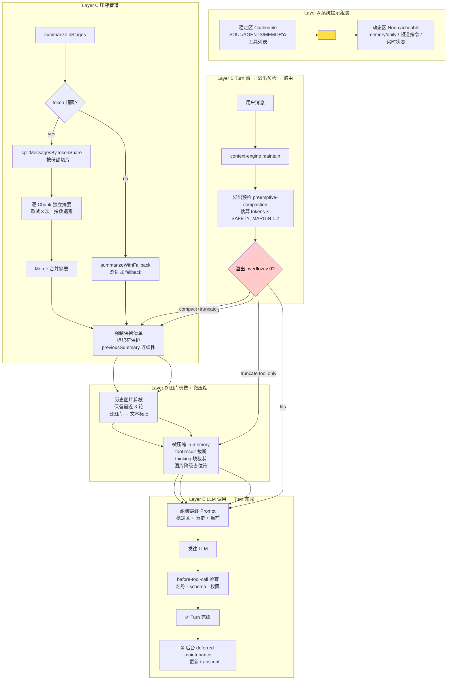
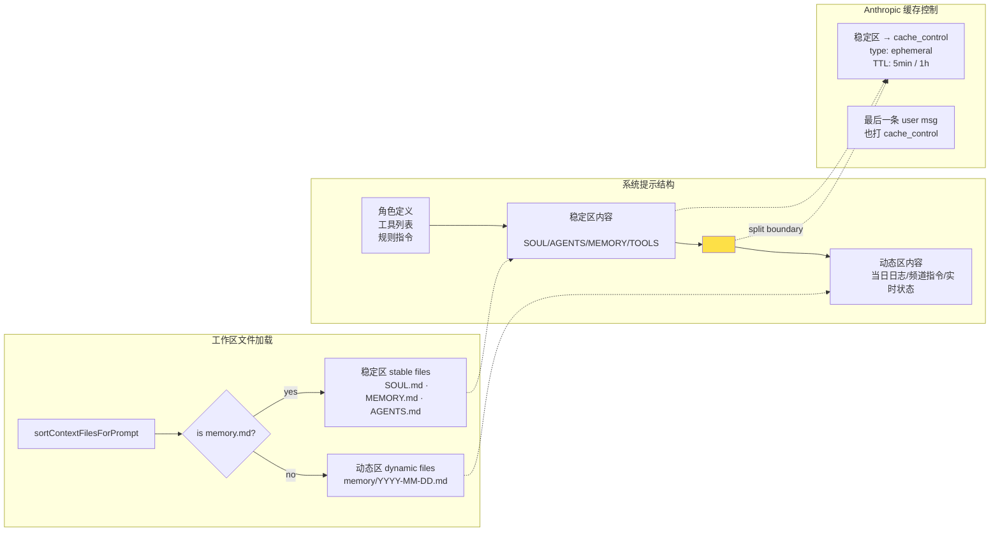
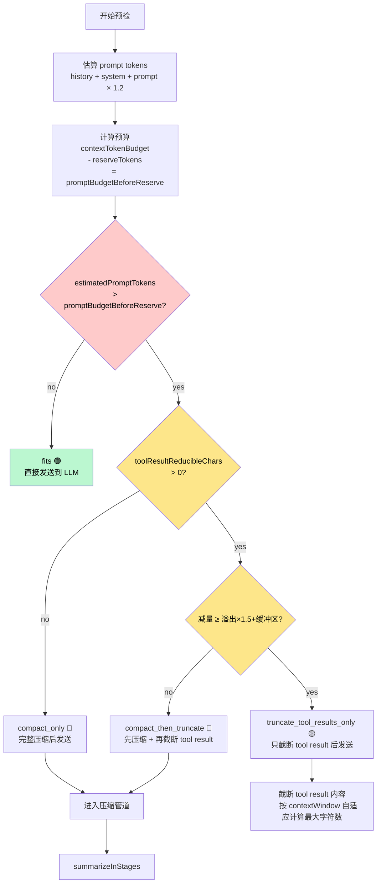

# 12 - 上下文管理

> 核心源文件：
> - `src/agents/compaction.ts` — 压缩/摘要核心逻辑
> - `src/agents/agent-compaction-constants.ts` — token 预算常量
> - `src/agents/context.ts` — 上下文窗口推断
> - `src/agents/embedded-agent-runner/run/preemptive-compaction.ts` — 溢出预检
> - `src/agents/embedded-agent-runner/run/history-image-prune.ts` — 图片剪枝
> - `src/agents/agent-hooks/context-pruning/pruner.ts` — 微压缩（in-memory）
> - `src/agents/system-prompt.ts` — 系统提示 + 缓存边界
> - `src/agents/system-prompt-cache-boundary.ts` — 缓存边界实现
> - `src/agents/anthropic-payload-policy.ts` — Anthropic 缓存控制

---

## 一、基本工作流程

### 整体架构

每次发起 LLM 请求时，OpenClaw 把以下内容拼装成 prompt：

```
系统提示（System Prompt）
    │
    ├── [稳定区] 角色定义、工具列表、基本指令
    │             SOUL.md / AGENTS.md / MEMORY.md
    │
    │   <!-- OPENCLAW_CACHE_BOUNDARY -->      ← 缓存边界标记
    │
    └── [动态区] 频繁变动的内容
                  当日 memory/*.md
                  频道/会话特定指令
                  实时状态（当前时间、用户偏好）

历史消息（History Messages）
    │
    ├── user
    ├── assistant
    ├── toolCall
    └── toolResult
                  ↑
         这里可能超长，上下文管理的重点就在这

新的用户消息（当前 prompt）
```

### 每次 turn 的处理流程

```
用户发消息
    │
    ├─① context-engine.maintain()（turn 前维护）
    │     └── 可 foreground 或 deferred background 执行
    │
    ├─② 溢出预检（preemptive compaction）
    │     └── 估算 prompt tokens，判断是否超出 contextTokenBudget
    │
    ├─③ 按路由执行
    │     ├── fits：直接发给 LLM
    │     ├── truncate_tool_results_only：压缩 tool result 内容后发
    │     ├── compact_only：触发压缩（summarization）后发
    │     └── compact_then_truncate：先压缩 + 再截断 tool result
    │
    ├─④ 发给 LLM，获得回复
    │
    └─⑤ turn 完成后，context-engine deferred maintenance
          └── 在后台异步写入 transcript 变更
```

---

## 二、如何解决上下文超长（Compaction / 压缩）

### 触发机制：溢出预检

每次发 prompt 前，在 `preemptive-compaction.ts` 里做估算：

```typescript
// 估算本次 prompt 的 token 数量
estimatedPromptTokens = historyTokens + systemTokens + promptTokens
// 乘以 1.2 安全系数（补偿 chars/4 估算误差）
estimatedPromptTokens *= SAFETY_MARGIN (1.2)
```

然后与 `contextTokenBudget` 对比，决定走哪条路：

| 路由 | 含义 | 触发条件 |
|------|------|---------|
| `fits` | 不压缩 | 预估 token < 预算 |
| `truncate_tool_results_only` | 只截断 tool result | 溢出，但 tool result 可减字符量 ≥ 溢出量×1.5+缓冲 |
| `compact_then_truncate` | 先压缩 + 再截断 | 溢出，tool result 减量不够，但有减量空间 |
| `compact_only` | 只做压缩 | 溢出，且 tool result 无可减内容 |

**预算计算（`agent-compaction-constants.ts`）：**

```typescript
MIN_PROMPT_BUDGET_TOKENS = 8_000    // 最小绝对预算
MIN_PROMPT_BUDGET_RATIO = 0.5       // 上下文窗口的 50% 必须留给 prompt
```

---

### 压缩核心：summarize（摘要化）

**核心思路：** 用 LLM 把历史消息总结成一段文字，替换掉原来的消息序列。

`compaction.ts` 的 `summarizeInStages()` 是主入口：

```
summarizeInStages()
    │
    ├── 消息太少或 token 不超限 → summarizeWithFallback()
    │
    └── 超限 → splitMessagesByTokenShare()（按 token 份额切分）
               每个 chunk 分别做 summarizeWithFallback()
               最后 merge（再调用一次 LLM 合并多段摘要）
```

**摘要 prompt 的重点（`MERGE_SUMMARIES_INSTRUCTIONS`）：**

```
必须保留：
- 进行中的任务及其状态
- 批量操作进度（如 5/17 已完成）
- 用户最后一个请求和正在做的事
- 已做的决策和原因
- TODO、待解决问题、限制条件
- 任何承诺的后续行动

最新的上下文优先于旧历史
```

**标识符保护策略（`IDENTIFIER_PRESERVATION_INSTRUCTIONS`）：**

```
所有不透明标识符必须原样保留（不能缩短或重新构造）：
UUIDs、哈希、IDs、主机名、IPs、端口、URLs、文件名
```

这是避免摘要后关键标识符出错的重要设计。

---

### 渐进式 fallback 机制

```
summarizeChunks()（全量摘要）
    │ 失败
    └── summarizeWithFallback()
          │
          ├── 过滤掉单条超过上下文 50% 的超大消息
          ├── 对剩余消息重新摘要
          │     失败
          │     └── 记录 partialSummary
          │
          └── 最终 fallback：
                "Context contained N messages (M oversized). Summary unavailable."
```

每个 chunk 重试 3 次（指数退避 500ms～5000ms），只要有一个 chunk 成功就持续推进。

---

### 模型切换时的 handoff 摘要

模型切换（如 quota 限制触发 failover）时，生成一个特殊的 **handoff summary**（`summarizeForHandoff()`）：

```
- 硬上限 4000 tokens
- 包含：当前目标、AutoClaw 等子代理状态、关键文件、待执行步骤
- 明确指出新模型是 LEADER，AutoClaw 等是 SUBORDINATE
- 指示新模型不要自己执行子代理的任务，只做监督和战略指令
```

---

### 历史消息剪枝（pruneHistoryForContextShare）

不做摘要时，也可以直接丢掉旧历史（`pruneHistoryForContextShare()`）：

```
模式 share：最多保留上下文窗口的 50%（默认）
模式 handoff：最多保留上下文窗口的 20%（更严格）
```

丢弃时按 token 份额切块，从最旧的块开始丢，保持 tool_use/tool_result 配对完整性（孤儿 tool_result 会被自动修复）。

---

## 三、如何解决历史记忆丢失

### 压缩后的信息保留

摘要时有明确的「必须保留」清单（见上节），设计上就是为了防止关键信息在压缩后消失。

### 标识符完整性

`identifierPolicy`（`strict` / `custom` / `off`）控制标识符保护级别，默认 `strict`，强制要求摘要中的所有标识符原字不变。

### 连续性设计：previousSummary

每次生成摘要时，把**上一次的摘要**也传给 LLM，作为 `previousSummary`：

```typescript
generateSummary(
    currentMessages,   // 当前要摘要的消息
    model,
    reserveTokens,
    apiKey,
    headers,
    signal,
    customInstructions,
    previousSummary,   // ← 上一轮已有的摘要
)
```

LLM 被要求在新摘要里合并历史摘要的信息，形成滚动积累。

### 图片/媒体的渐进丢弃

图片不可能摘要成文字，用专门的机制处理（`history-image-prune.ts`）：

```
保留最近 3 个完成 turn 的图片
超出范围的历史图片 → 替换为文字标记：
  "[image data removed - already processed by model]"
  "[media reference removed - already processed by model]"
```

这样既减少 token 占用，又保留了「这里曾有图片」的信息。

---

## 四、如何节省 Token

### 1. 系统提示缓存分区（Prompt Cache）

系统提示被 `<!-- OPENCLAW_CACHE_BOUNDARY -->` 分成两段：

```
[稳定区] 角色定义、工具说明、SOUL.md、MEMORY.md、AGENTS.md
         → 加 cache_control: { type: "ephemeral" }
         → Anthropic 5 分钟缓存（api.anthropic.com 支持 1h TTL）
         → 每次请求 cache 命中 = 这部分 token 不收费/大幅折扣
         
[动态区] 频繁变动的内容（当前时间、日志、动态状态）
         → 不加缓存，每次重新计算
```

**Context 文件排序策略（`system-prompt.ts`）：**

```typescript
// 稳定文件（SOUL.md, AGENTS.md, MEMORY.md）→ 放在缓存边界之前
// 动态文件（memory/YYYY-MM-DD.md）→ 放在缓存边界之后
```

越稳定的内容越靠前，越动态的越靠后，最大化 cache 命中范围。

### 2. tool result 截断（Truncation）

工具返回的大量内容是主要的 token 来源。溢出时，优先对 tool result 做截断而非完整压缩（`truncate_tool_results_only` 路由成本更低）。

截断策略：根据 `contextWindowTokens` 自适应计算最大字符数（`tool-result-truncation.ts`）。

### 3. 图片历史剪枝

图片每张估计 2000 tokens（`IMAGE_BLOCK_TOKENS`），超出最近 3 轮后立即替换为文本标记，节省大量 token。

### 4. 微压缩（Context Pruning）

不触发完整 compaction 时，可做轻量级 in-memory 裁剪（`agent-hooks/context-pruning/`）：

- 对 tool result 做内容截断
- 对旧消息做思维链（thinking）块裁剪（`dropThinkingBlocks`）
- 对图片块降级为占位符

**特点**：只影响本次 LLM 请求的 in-memory 上下文，不修改磁盘上的 transcript 文件。

### 5. lightContext / lightBootstrap（子代理）

`sessions_spawn` 时可设 `lightContext: true`：

```typescript
// src/agents/subagent-spawn.ts:1102
const bootstrapContextMode: BootstrapContextMode | undefined = params.lightContext
    ? "light" : undefined;
```

轻量上下文模式：子代理启动时不加载完整的 context 文件，节省初始 token 开销。

### 6. 上下文窗口推断

`context.ts` 会主动发现各模型的实际 context window，避免低估导致的过度压缩或高估导致的 OOM：

- 优先用配置文件里的显式配置
- 再用模型注册表里的 discovered 值
- Claude Sonnet/Opus 4.x 系列强制使用 100 万 token 窗口（`ANTHROPIC_CONTEXT_1M_TOKENS = 1_048_576`）

---

## 五、如何确保 Tool / Skill 调用的准确度

### 1. 系统提示里的工具列表

每次请求的系统提示里包含当前可用工具的名称+说明，并明确声明：

```
"Available tools are policy-filtered. Names are case-sensitive; call exactly as listed."
```

工具名大小写敏感，只能调用列出来的工具。

### 2. tool schema 规范化

不同 LLM 提供商对 JSON Schema 的要求不一样，OpenClaw 做了针对性处理：

- `schema/clean-for-gemini.ts` — 清理 Gemini 不支持的字段
- `schema/string-enum.ts` — 某些 provider 拒绝 `anyOf`，改用 flat string enum
- `openai-tool-schema.ts` — 规范化 OpenAI 格式的工具 schema
- `agent-tools-parameter-schema.ts` — 统一参数 schema 处理

**schema 层保障：** 工具参数通过 TypeBox schema 定义，LLM 的调用参数必须符合 schema，不符合的直接报错，不会静默接受。

### 3. tool 权限策略（Policy）

`agent-tools.policy.ts` 管理哪些工具对哪个 session 可见：

```typescript
// 子代理始终禁用的工具（无论深度）
SUBAGENT_TOOL_DENY_ALWAYS = [
    "gateway",      // 危险的系统管理
    "agents_list",
    "session_status",
    "cron",
    "sessions_send",
]

// 叶子子代理（最深层）额外禁用
SUBAGENT_TOOL_DENY_LEAF = [
    "subagents",
    "sessions_list",
    "sessions_history",
    "sessions_spawn",
]
```

只有当前 session 实际被授权的工具才会出现在系统提示里，LLM 自然不会调用不存在的工具。

### 4. toolsAllow 白名单（cron / sessions_spawn）

`cron` 工具和 `sessions_spawn` 支持 `toolsAllow` 参数，明确指定子 session 或定时任务只能使用的工具列表，进一步缩小工具范围，降低误调用概率。

### 5. Skill 系统的准确度设计

**Skill 文件（SKILL.md）只在需要时才读取：**

```
系统提示里列出所有 available skills 及其描述
  ↓
LLM 判断哪个 skill 最相关
  ↓
用 read 工具加载 SKILL.md（只加载一个）
  ↓
按 SKILL.md 的指令执行
```

这样避免了把所有 skill 的完整指令都塞进系统提示（浪费 token + 干扰判断），只在需要时按需加载。

**Skill 选择原则（系统提示里明确写了）：**

```
选最匹配的一个，不要读多个
如果没有明确匹配的，一个都不读
```

### 6. 工具调用前检查（before-tool-call）

`agent-tools.before-tool-call.ts` 在每次工具调用前做检查：

- 工具名是否在当前允许列表里
- 参数是否符合 schema
- 是否需要用户确认（exec approval 机制）

### 7. 上下文保真度：标识符完整性

压缩后 UUIDs、文件路径等关键标识符如果出错，工具调用就会定向到错误的目标。`IDENTIFIER_PRESERVATION_INSTRUCTIONS` 专门保护这一点，确保即使历史被摘要，摘要里的关键标识符也是精确的。

---

## 六、整体架构一张图

<details>
<summary>📐 展开查看所有 Mermaid 流程图</summary>

> Mermaid 图在 GitHub Markdown 中自动渲染，可交互缩放。如果当前阅读器不支持 Mermaid，请切换到 GitHub Web 查看。

---

### 图 1：全流程总览



---

### 图 2：系统提示缓存策略



---

### 图 3：路由决策树



---

### 图 4：压缩管道详情

```mermaid
flowchart TD
    A[[summarizeInStages 入口]] --> B{检查消息量是否
      超出 reserveTokens?}
    B -- 否 --> C[summarizeWithFallback
      单次摘要]
    B -- 是 --> D[splitMessagesByTokenShare
      按 token 份额切片]
    D --> E[Chunk 1] & F[Chunk 2] & G[Chunk N]
    E --> H[summarizeWithFallback
      重试 3 次 | 500ms-5000ms 退避]
    F --> I[summarizeWithFallback
      重试 3 次 | 500ms-5000ms 退避]
    G --> J[summarizeWithFallback
      重试 3 次 | 500ms-5000ms 退避]
    H --> K[merge 合并
      再调用 LLM 合并多段摘要]
    I --> K
    J --> K
    K --> L[输出最终摘要]
    C --> L

    L --> M{摘要成功?}
    M -- 是 --> N["✅ 替换历史消息为摘要
       保留: 任务状态 · 决策 · TODO
       标识符: UUID/路径/URL 原样
       连续性: 传入 previousSummary"]
    M -- 否 --> O[渐进式 Fallback
      1. 过滤超大消息 (&gt;50% 窗口)
      2. 剩余消息重试摘要
      3. 记录 partialSummary
      4. 最终 fallback 文本]

    style M fill:#fecaca,color:#000
    style N fill:#bbf7d0,color:#000
```

</details>


---

## 八、关键常量汇总

| 常量 | 值 | 含义 |
|------|-----|------|
| `MIN_PROMPT_BUDGET_TOKENS` | 8,000 | 最小 prompt 预算绝对值 |
| `MIN_PROMPT_BUDGET_RATIO` | 0.5 | 上下文窗口中 prompt 最小占比 |
| `SAFETY_MARGIN` | 1.2 | token 估算的安全系数（补偿低估） |
| `BASE_CHUNK_RATIO` | 0.4 | 默认 chunk 比例 |
| `MIN_CHUNK_RATIO` | 0.15 | 最小 chunk 比例（大消息自适应） |
| `SUMMARIZATION_OVERHEAD_TOKENS` | 4,096 | 摘要 prompt 本身的 token 开销 |
| `IMAGE_BLOCK_TOKENS` | 2,000 | 单张图片的估算 token 数 |
| `PRESERVE_RECENT_COMPLETED_TURNS` | 3 | 图片保留的最近 turn 数 |
| `ANTHROPIC_CONTEXT_1M_TOKENS` | 1,048,576 | Claude Sonnet/Opus 4.x 的上下文窗口 |
